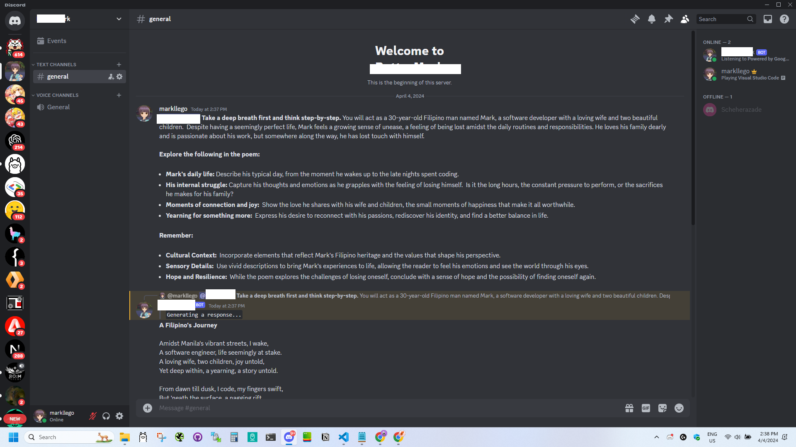
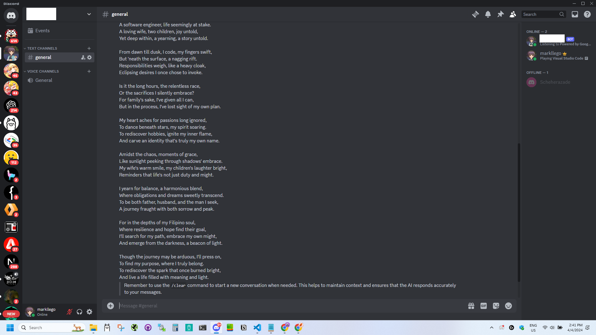

# Discord Bot with Google Generative AI (Gemini) Integration

This is a Discord bot that integrates with Google Generative AI, specifically the Gemini model, to provide conversational capabilities. Gemini is Google's largest and most capable AI model. The bot can respond to user messages, maintain conversation history, and perform various commands. 

## Features

- Responds to user messages using Google Generative AI
- Maintains conversation history for each user
- Supports slash commands for user interactions
- Clears conversation history using the `/clear` command
- Saves conversation and sends it to the user's inbox using the `/save` command
- Automatically changes the bot's presence status every 30 seconds

## Screenshots

Please keep in mind that this project is a work in progress, and breaking changes or new features may be introduced in future updates.